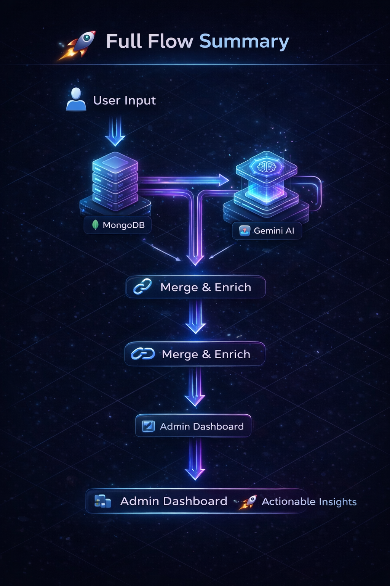
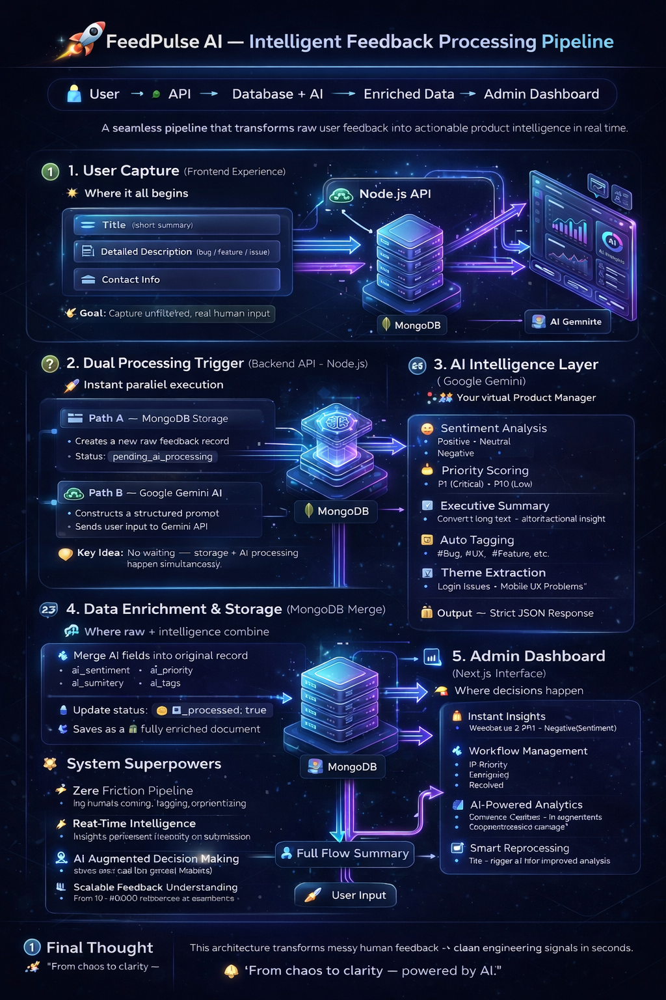

<div align="center">
  <h1>🚀 FeedPulse AI — Intelligent Feedback Processing System</h1>
  <p><h3>Transform messy user feedback into structured, actionable product insights using AI.</h3></p>
  <br />
</div>

## 🌐 Overview
**FeedPulse AI** is an end-to-end feedback processing platform that leverages **Google Gemini AI** to automatically analyze, categorize, and prioritize user feedback in real-time. 

It eliminates manual effort by converting raw user input into structured engineering-ready data.

---

## ✨ Key Features
- 🧠 **AI-powered sentiment analysis**
- 🔥 **Automatic priority scoring (P1–P10)**
- 🏷️ **Smart tagging (#Bug, #UX, #Feature)**
- 📊 **Theme extraction & trend detection**
- ⚡ **Real-time processing pipeline**
- 🧩 **Seamless MongoDB integration**
- 📈 **Admin dashboard with actionable insights**

---

## 🏗️ System Architecture

<div align="center">
  
  <p><em>Summary configuration of the FeedPulse Intelligent Architecture</em></p>
</div>

```
User → Node.js API → MongoDB + Gemini AI → Enriched Data → Admin Dashboard
```

---

## 🔄 Workflow Breakdown

<div align="center">
  
  <p><em>Detailed Step-by-Step AI Implementation Workflow</em></p>
</div>

### 🟢 1. User Capture (Frontend)
Users submit feedback via a simple, intuitive form including:
- **Title**
- **Description**
- **Contact Info**

### ⚡ 2. Backend Processing (Node.js API)
Upon submission:
- Data is securely sent to the backend.
- The process splits into two parallel, highly efficient flows:
  - 🗄️ **MongoDB**: Stores the raw feedback (Status: `pending_ai_processing`).
  - 🧠 **Gemini AI**: Sends an engineered prompt and requests structured analysis.

### 🧠 3. AI Intelligence Layer (Google Gemini)
Gemini processes the feedback context and returns precise data points:
- 😊 **Sentiment** *(Positive / Neutral / Negative)*
- 🔥 **Priority Score** *(P1–P10)*
- 🧾 **Executive Summary**
- 🏷️ **Tags** *(e.g., #Bug, #UX, #Feature)*
- 📊 **Theme Extraction**

📦 **Output format:** Strict JSON payload

### 🔗 4. Data Enrichment (MongoDB Merge)
The backend intelligently merges the AI response with the original database record:

```json
{
  "ai_sentiment": "Negative",
  "ai_priority": "P2",
  "ai_summary": "Login fails on mobile devices",
  "ai_tags": ["#Bug", "#Mobile"],
  "ai_processed": true
}
```

### 📊 5. Admin Dashboard (Next.js)
Empowered by AI-enriched data, Admins can:
- 🚨 **Identify critical issues instantly** based on automated AI scoring.
- 🔄 **Manage feedback lifecycle** seamlessly (New, In Review, Resolved).
- 📈 **Generate insights & trends** across their product context.
- 🔁 **Re-trigger AI processing** if needed manually.

---

## 🧠 AI Capabilities
FeedPulse AI acts like your 24/7 virtual product manager:
- ✔️ **Understands user intent**
- ✔️ **Prioritizes issues automatically**
- ✔️ **Highlights recurring problems**
- ✔️ **Reduces analysis time from hours → seconds**

---

## 🛠️ Tech Stack

| Layer | Technology |
| :--- | :--- |
| **Frontend** | ⚛️ Next.js / React |
| **Backend** | 🟢 Node.js / Express |
| **Database** | 🍃 MongoDB |
| **AI Engine** | ⚙️ Google Gemini API |
| **Styling** | 🎨 Tailwind CSS |

---

<div align="center">
  <p><i>Built to make product iteration smarter and faster.</i></p>
</div>
